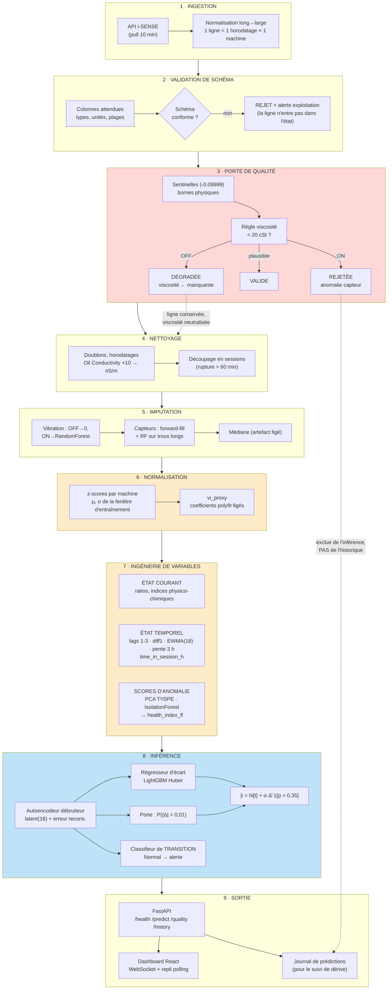
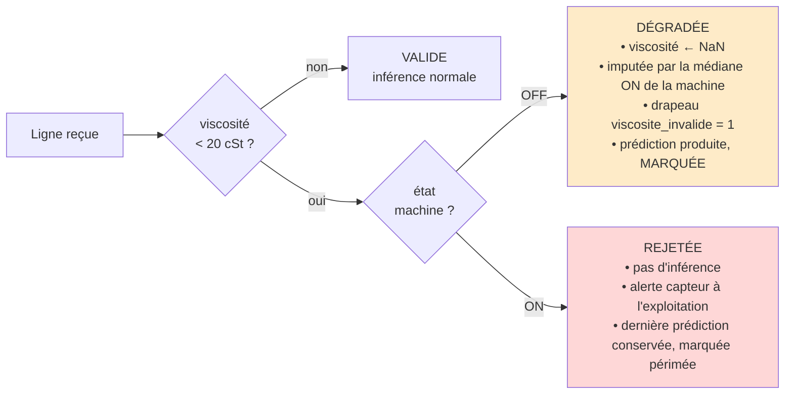
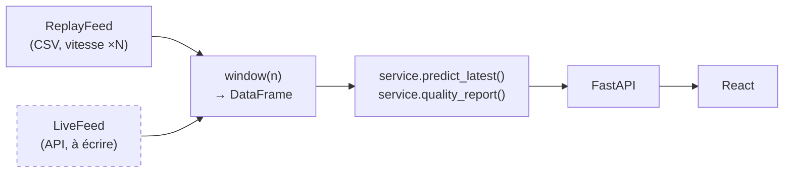

# Architecture du pipeline de production — Health Index i-SENSE

**Objet :** chemin de production de l'ingestion API jusqu'au tableau de bord, artefacts ajustés,
gestion des défaillances, budget de latence, et les trois points durs — skew entraînement/service,
machine à l'arrêt, dérive de l'étiquette.

---

## 1. Vue d'ensemble



---

## 2. Détail par étage

| # | Étage | Ce qu'il fait | Artefacts **ajustés** consommés | Budget latence |
|---|---|---|---|---|
| 1 | Ingestion | Pull API, pivot long→large | — | 200–800 ms (réseau) |
| 2 | Validation schéma | Colonnes, types, unités, plages | `schema.json` (versionné) | < 5 ms |
| 3 | Porte de qualité | Sentinelles, bornes physiques, règle viscosité | `quality_rules.json` | < 5 ms |
| 4 | Nettoyage | Doublons, conversion nS/m, découpage sessions | `cleaning_config.json` | < 10 ms |
| 5 | Imputation | Vibration (RF), capteurs (ff + RF), médiane | **`vibration_imputer.joblib`**, **`fill_medians.json`** | 15–40 ms |
| 6 | Normalisation | z-scores par machine, vi_proxy | **`zscore_stats.json`**, **`vi_proxy_coefs.json`** | < 5 ms |
| 7 | Variables | lags, EWMA, pentes, indices, scores d'anomalie | **`pca_{A,B}.joblib`**, **`isoforest_{A,B}.joblib`**, **`alarm_thresholds.json`** | 20–50 ms |
| 8 | Inférence | AE → régresseur + porte + classifieur transition | **`ae_denoiser.pt`**, **`reg_huber.joblib`**, **`gate.joblib`**, **`transition_clf.joblib`** | 30–80 ms |
| 9 | Sortie | API, dashboard, journal | — | 10–30 ms |
| | **Total** | | | **~0,3–1,0 s par lot de 2 machines** |

Le budget est très en dessous de la cadence d'acquisition (10 min). **La latence n'est pas la
contrainte de ce système** ; la fraîcheur des données l'est. Le tableau de bord affiche l'âge de la
dernière mesure et bascule en « périmé » au-delà de 30 minutes.

### Versionnement des artefacts

```
artifacts/
  v2026-09-08/                      ← une version = un entraînement complet
    manifest.json                   ← empreintes SHA-256, fenêtre d'entraînement, métriques gelées
    schema.json  quality_rules.json  cleaning_config.json
    vibration_imputer.joblib  fill_medians.json
    zscore_stats.json  vi_proxy_coefs.json
    pca_A.joblib  pca_B.joblib  isoforest_A.joblib  isoforest_B.joblib
    alarm_thresholds.json
    ae_denoiser.pt  reg_huber.joblib  gate.joblib  transition_clf.joblib
  courant -> v2026-09-08            ← lien symbolique, bascule atomique
```

Le service charge `courant/manifest.json` au démarrage, vérifie **toutes** les empreintes, et refuse
de démarrer si l'une diffère. Une version n'est jamais modifiée en place : un réentraînement crée un
nouveau répertoire, et la bascule est un changement de lien.

---

## 3. Point dur n° 1 — SKEW ENTRAÎNEMENT / SERVICE

**Le problème est réel et il s'est produit pendant ce projet.** Le premier lancement de l'API a
échoué avec `KeyError: ['health_index_lf', 'HI_pca_spe_lf', 'HI_isoforest_lf',
'Oil System Vibration_filled_zscore_lf'] not in index` : le service servait le CSV brut alors que le
modèle attendait les variables reconstruites sans fuite. Pire, un `try/except` dans le panneau
historique masquait l'erreur en retombant silencieusement sur la persistance — la courbe s'affichait,
fausse. **Les deux ont été corrigés** (`dashboard/backend/service.py`), et le repli silencieux a été
supprimé au profit d'une remontée d'erreur.

### Les variables à état, et comment l'état est tenu

| Variable | Dépend de | État à maintenir en ligne |
|---|---|---|
| `*_lag1..3` | 3 lignes précédentes de la session | tampon circulaire de 3 lignes |
| `*_diff1` | ligne précédente | dernière valeur |
| `*_ewma` (span 18) | tout le passé de la session | **valeur EWMA courante uniquement** (récurrence) |
| `*_slope_3h` | 18 dernières lignes | tampon circulaire de 18 lignes |
| `time_in_session_h` | horodatage de début de session | horodatage de début |
| `measure_index_in_session` | compteur | entier |
| `*_zscore_lf` | μ, σ **figés** de l'entraînement | aucun état (paramètres chargés) |
| `vi_proxy_lf` | coefficients **figés** | aucun état |
| `HI_pca_*_lf`, `HI_isoforest_lf` | modèles **figés** | aucun état |

**Décision d'architecture :** l'état en ligne est un objet `SessionState` par machine, contenant un
tampon circulaire de 18 lignes, la valeur EWMA courante, l'horodatage de début de session et le
compteur. Il est **persisté** (Redis ou table SQL) après chaque ligne, pour survivre à un
redémarrage. À froid, le service recharge les 18 dernières lignes depuis la base historique et
recalcule l'état — c'est exactement ce que fait le mode rejeu avec son `warmup_rows = 600`.

L'EWMA se met à jour par récurrence, sans historique :
`ewma_t = α·x_t + (1−α)·ewma_{t−1}`, avec `α = 2/(span+1) = 2/19`.

### Comment on TESTE que l'en-ligne égale le hors-ligne

Test de non-régression obligatoire à chaque version d'artefacts :

1. Prendre les 2 000 dernières lignes du jeu historique.
2. Calculer les variables **hors ligne** (`protocol.prepare()` sur le lot complet).
3. Rejouer les **mêmes lignes une par une** dans le `SessionState` en ligne.
4. Comparer colonne par colonne : `max |offline − online| < 1e-9` pour toute variable déterministe.
5. Comparer la prédiction finale : `max |ŷ_offline − ŷ_online| < 1e-9`.
6. **Échec du test = blocage du déploiement.**

Les seules divergences tolérées sont les 17 premières lignes d'une session (fenêtre incomplète), qui
doivent produire `NaN` des deux côtés — jamais une valeur remplie par défaut.

Un second garde-fou tourne en continu : le service journalise chaque vecteur de variables servi, et
un lot nocturne recalcule les mêmes lignes hors ligne. Toute dérive au-delà de `1e-9` déclenche une
alerte d'ingénierie, pas une alerte machine.

---

## 4. Point dur n° 2 — MACHINE À L'ARRÊT ET VISCOSITÉ INVALIDE

Rappel du constat : **16 839 lignes (39,96 % du jeu) portent une viscosité de 3 à 20 cSt pour une
ISO VG 46 (référence 46 cSt). 100 % sont la Motosoufflante B à l'arrêt**, soit 84 % de ses lignes
OFF. La Motosoufflante A à l'arrêt lit 45,6 cSt — physiquement correct, l'huile froide est plus
visqueuse. B lit 7,5 cSt : le signe est inversé.

### Règle de décision



**Pourquoi ne pas simplement rejeter les lignes OFF ?** Parce que la machine B est à l'arrêt 90 % du
temps. Les rejeter reviendrait à ne rien surveiller. On neutralise la variable fautive et on conserve
la ligne, avec un drapeau que le modèle reçoit en entrée et que le tableau de bord affiche.

**Pourquoi c'est prioritaire.** L'expérience décisive (§ III.4bis du rapport d'audit) montre que
masquer cette viscosité fait passer le skill de la Motosoufflante A de **−0,119 à +0,086** et rend
le bénéfice global statistiquement significatif pour la première fois (n_eff de 98 à 1 707). Ce
n'est pas de l'hygiène : c'est la modification qui rend le système mesurable.

**Question ouverte transmise à l'équipe i-SENSE** ([Note_Viscosite_iSENSE.docx](Note_Viscosite_iSENSE.docx)) :
le viscosimètre renvoie-t-il un code d'erreur que l'export ne transporte pas ? Si oui, la règle
`< 20 cSt` doit être remplacée par la lecture de ce code — un seuil numérique est un palliatif.

---

## 5. Point dur n° 3 — DÉRIVE DE L'ÉTIQUETTE ET RÉENTRAÎNEMENT

**Le problème structurel :** `health_index` n'est pas une mesure, c'est un score construit. La PCA,
l'Isolation Forest et les seuils d'alarme sont ajustés sur une fenêtre d'entraînement et définissent
« ce qui est normal ». À mesure que l'huile vieillit, l'état réel s'éloigne de cette référence et
**l'indice baisse pour des raisons qui ne sont pas une dégradation de la machine**.

C'est déjà visible dans les données : avec l'étiquette sans fuite, la période de test contient
**73,3 % de lignes en alerte** contre une période d'entraînement majoritairement Normale. Une partie
de cet écart est de la dérive de référence, pas de la dégradation.

### Ce qu'on surveille

| Indicateur | Calcul | Seuil d'alerte | Fenêtre |
|---|---|---|---|
| Dérive des entrées | PSI par variable, servi vs entraînement | PSI > 0,25 | 7 j glissants |
| Dérive de l'indice | moyenne `health_index` servie vs entraînement | écart > 2 σ | 7 j |
| **Part en alerte** | % de lignes non Normal | > 30 % sur 7 j | 7 j |
| Fréquence d'ouverture de la porte | % de lignes corrigées | hors [10 %, 55 %] | 7 j |
| Erreur réalisée | MAE à t+3 h, une fois la cible connue | > 1,3 × MAE gelée | 14 j |
| **Skill réalisé** | 1 − MSE_modèle / MSE_persistance | **< 0** pendant 7 j | 7 j |
| Qualité | % de lignes rejetées | > 5 % | 24 h |

### Déclencheurs de réentraînement

1. **Calendaire** — tous les 3 mois, systématiquement.
2. **Sur dérive** — deux indicateurs au rouge simultanément pendant 7 jours.
3. **Sur perte de skill** — skill réalisé négatif sur 7 jours glissants. C'est le déclencheur
   décisif : un skill négatif signifie que le système fait moins bien que « rien ne change », et
   dans ce cas **la bonne action immédiate est de basculer sur la persistance**, pas d'attendre le
   réentraînement.
4. **Sur événement** — vidange, changement de filtre, intervention. La référence « saine » doit être
   réajustée après, sinon l'indice reste calé sur l'huile précédente.

### Procédure de réentraînement

Réexécuter le protocole gelé de bout en bout : nouvelle fenêtre d'entraînement, nouvelle
reconstruction de l'étiquette train-only, nouvelle CV purgée, nouveau test gelé, nouveau bootstrap.
**Une nouvelle version n'est promue que si son skill est significativement positif sur le nouveau
test gelé** — même critère que l'audit, aucune exception. Sinon la version courante est conservée,
ou le système bascule sur la persistance.

> **Limite à énoncer clairement.** Tant qu'il n'existe pas de vérité terrain — dates de vidange,
> interventions, analyses d'huile en laboratoire — la surveillance de dérive ne peut pas distinguer
> « l'huile se dégrade vraiment » de « la référence est périmée ». C'est la première des trois
> actions recommandées par l'audit, et aucune amélioration de modèle ne s'y substitue.

---

## 6. Comportement en cas de défaillance

| Défaillance | Comportement | Visible par l'utilisateur |
|---|---|---|
| API injoignable | Dernier instantané valide conservé | Bandeau + âge de la donnée |
| Schéma non conforme | Ligne rejetée, alerte ingénierie | Compteur « rejetées » |
| Viscosité impossible, OFF | Neutralisée, prédiction marquée | Badge « dégradée » |
| Viscosité impossible, ON | Ligne rejetée, pas d'inférence | Badge « rejetée » + motif |
| > 50 % de capteurs manquants | Ligne rejetée | Compteur |
| Empreinte d'artefact invalide | **Refus de démarrer** | Service indisponible |
| État de session perdu | Reconstruction depuis l'historique (18 lignes) | Transparent |
| Modèle en erreur | Bascule persistance, marquée comme telle | « Aucune prévision fiable — valeur maintenue » |
| Skill réalisé négatif 7 j | Bascule persistance automatique + ticket | Bandeau d'avertissement |

Le principe est constant : **jamais de repli silencieux**. Toute dégradation est affichée. C'est ce
que le tableau de bord fait déjà pour les horizons où aucun modèle ne bat la persistance, en les
libellant « Aucune prévision fiable — valeur maintenue » plutôt qu'en les présentant comme une
prévision.

---

## 7. Chemin de code partagé entre rejeu et temps réel

Il n'existe pas de flux live aujourd'hui. Le mode rejeu diffuse le CSV historique à vitesse
configurable **par le même chemin de code** qu'un flux réel :



`ReplayFeed` n'expose qu'une chose : « quelles lignes sont arrivées jusqu'à maintenant ». Passer au
temps réel demande d'écrire une classe `LiveFeed` de même interface. **Aucun étage en aval ne
change** — c'est la propriété qui rend la bascule sûre.

**Transport choisi :** WebSocket (`/ws`, 1 message toutes les 2 s) avec **repli automatique en
polling REST** toutes les 5 s si la connexion échoue. Le tableau de bord affiche lequel des deux est
actif. WebSocket parce que la cadence est faible et régulière ; le repli parce qu'un proxy
d'entreprise coupe fréquemment les connexions longues.

---

*Documents liés : [REPORT.md](hi_forecast/REPORT.md) (audit), [RAPPORT_AUTOENCODEURS.md](hi_forecast/RAPPORT_AUTOENCODEURS.md),
[Note_Viscosite_iSENSE.md](hi_forecast/Note_Viscosite_iSENSE.md), [dashboard/](dashboard/).*
